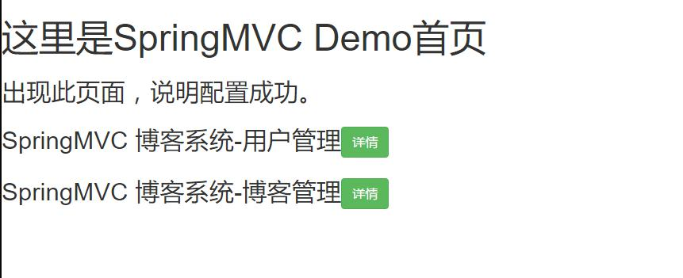
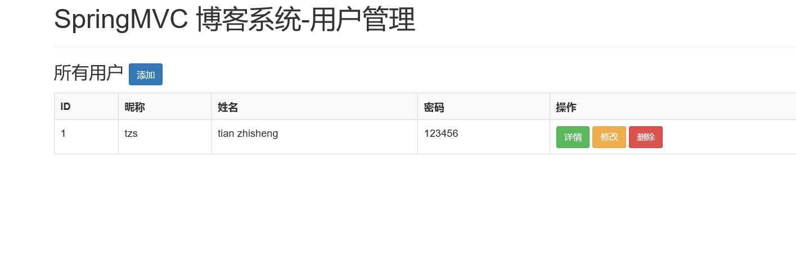
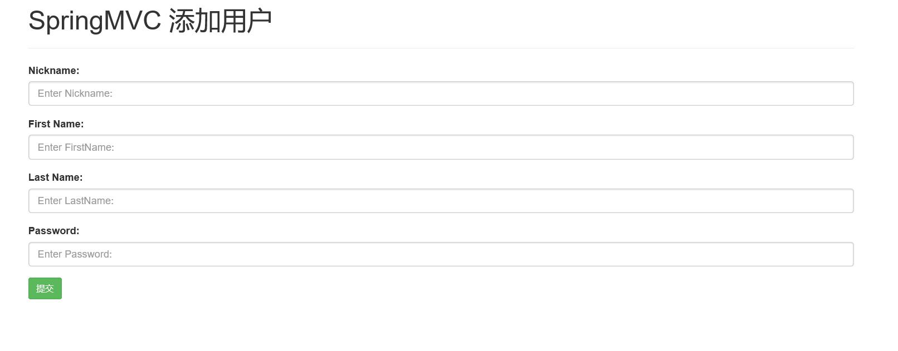
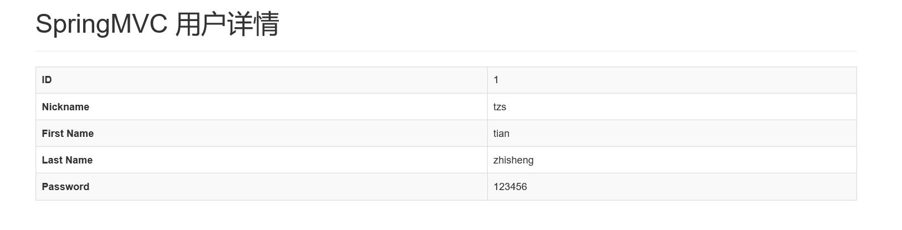
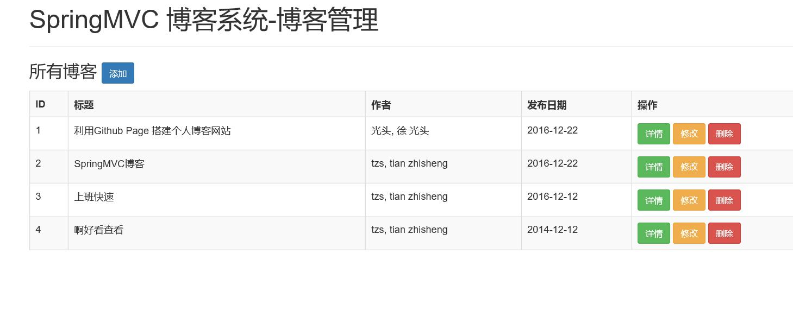
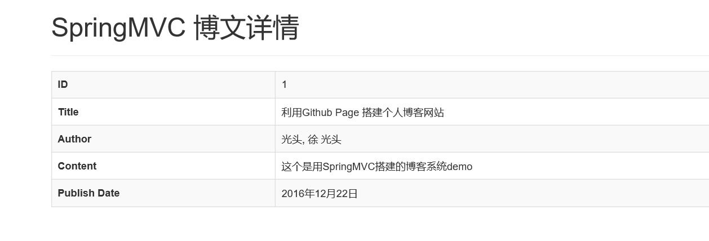
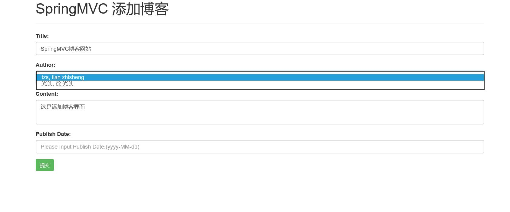
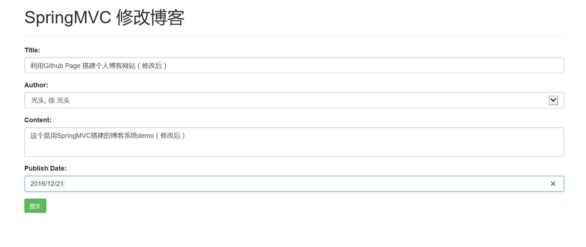
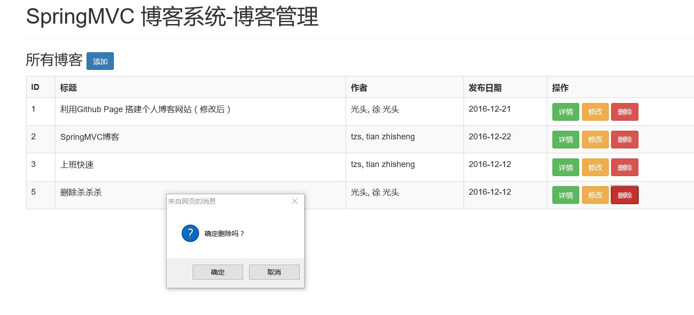

# Spring MVC

Spring MVC Study

***

## 学习笔记：

### 1、 [Spring MVC学习笔记](springmvc.md)

***

## 项目

### 1、Spring MVC + Hibernate JPA + Bootstrap 搭建的博客系统 Demo

**数据库**：[springdemo.sql](sql/springdemo.sql)

#### 截图：

**首页**

  

 
 

**用户管理模块**

+ 用户列表

  

+ 添加用户

  

+ 用户信息详情

  

+ 更新用户信息

  

+ 删除用户

  

 
 

**博客管理模块**

+ 博客列表

  

+ 博客详情

  

+ 添加博客

  

+ 更新博客

  

+ 删除博客

  

