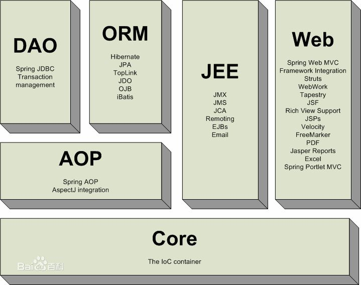
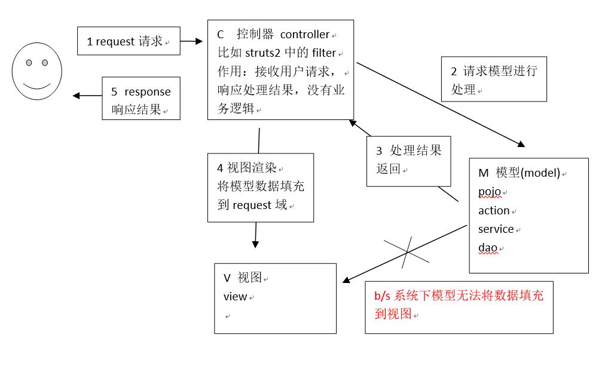
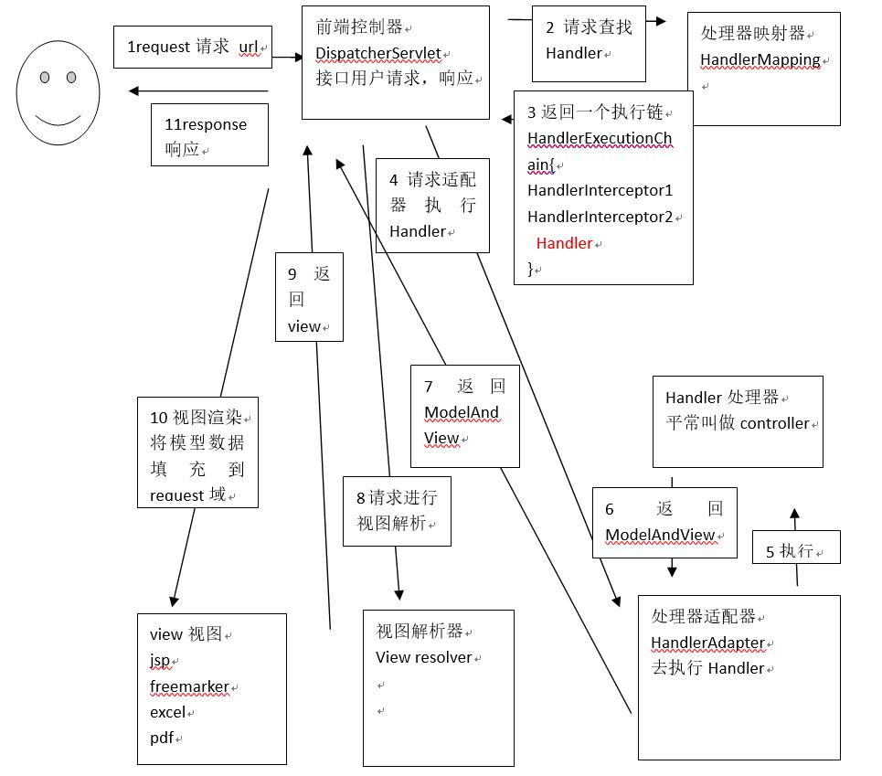

## Spring MVC基础知识

什么是Spring MVC？

Spring MVC框架原理（掌握）

​	前端控制器、处理器映射器、处理器适配器、试图解析器

Spring MVC 入门程序

​	目的：对前端控制器、处理器映射器、处理器适配器、试图解析器学习

​	非注解的处理器映射器、处理器适配器

​	注解的处理器映射器、处理器适配器（掌握）	

Spring MVC 和 Mybatis 整合（掌握）

Spring MVC 注解开发：（掌握）

​	常用的注解学习

​	参数绑定（简单类型，pojo类型、集合类型）

​	自定义的参数绑定（掌握）

Spring MVC 和 Struts2区别

 

## Spring MVC高级应用

参数绑定（集合类型）

数据回显

上传图片

json 数据交互

RESTful 支持

拦截器

***

## Spring MVC 框架

### 什么是Spring MVC？

springmvc是spring框架的一个模块，springmvc和spring无需通过中间整合层进行整合。
springmvc是一个基于mvc的web框架。

### Web MVC 

MVC 设计模式在  **B/S** 系统下应用：

1、  用户发起request请求至控制器(Controller)

控制接收用户请求的数据，委托给模型进行处理

2、  控制器通过模型(Model)处理数据并得到处理结果

模型通常是指业务逻辑

3、  模型处理结果返回给控制器

4、  控制器将模型数据在视图(View)中展示

web中模型无法将数据直接在视图上显示，需要通过控制器完成。如果在C/S应用中模型是可以将数据在视图中展示的。

5、  控制器将视图response响应给用户

通过视图展示给用户要的数据或处理结果。

### Spring MVC 框架

第一步：发起请求到前端控制器(DispatcherServlet)

第二步：前端控制器请求HandlerMapping查找 Handler

         可以根据xml配置、注解进行查找

第三步：处理器映射器HandlerMapping向前端控制器返回Handler

第四步：前端控制器调用处理器适配器去执行Handler

第五步：处理器适配器去执行Handler

第六步：Handler执行完成给适配器返回ModelAndView

第七步：处理器适配器向前端控制器返回ModelAndView

         ModelAndView是springmvc框架的一个底层对象，包括Model和view

第八步：前端控制器请求视图解析器去进行视图解析

         根据逻辑视图名解析成真正的视图(jsp)

第九步：视图解析器向前端控制器返回View

第十步：前端控制器进行视图渲染

         视图渲染将模型数据(在ModelAndView对象中)填充到request域

第十一步：前端控制器向用户响应结果

**组件**：

1、前端控制器DispatcherServlet（不需要程序员开发）

作用接收请求，响应结果，相当于转发器，中央处理器。

有了DispatcherServlet减少了其它组件之间的耦合度。

2、处理器映射器HandlerMapping(不需要程序员开发)

作用：根据请求的url查找Handler

3、处理器适配器HandlerAdapter

作用：按照特定规则（HandlerAdapter要求的规则）去执行Handler 

4、处理器Handler(需要程序员开发)

注意：编写Handler时按照HandlerAdapter的要求去做，这样适配器才可以去正确执行Handler

5、视图解析器View resolver(不需要程序员开发)

作用：进行视图解析，根据逻辑视图名解析成真正的视图（view）

6、视图View(需要程序员开发jsp)

View是一个接口，实现类支持不同的View类型（jsp、freemarker、pdf...）

## 入门程序

### 需求：

以案例作为驱动，springmvc 和 mybaits 整合的一个案例（商品订单管理）。

功能需求：商品列表查询

